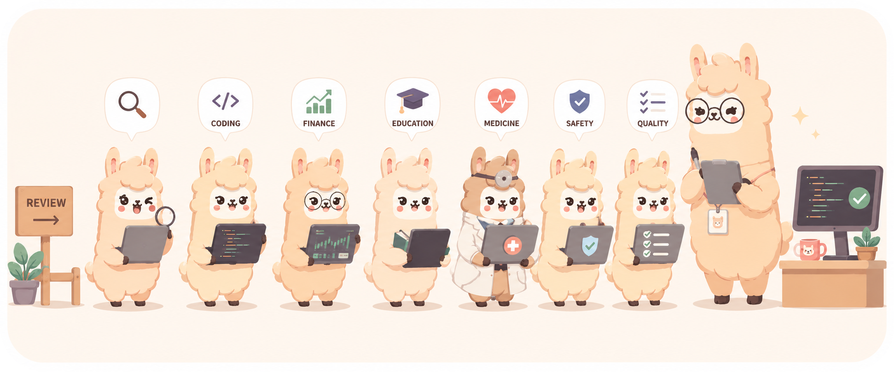
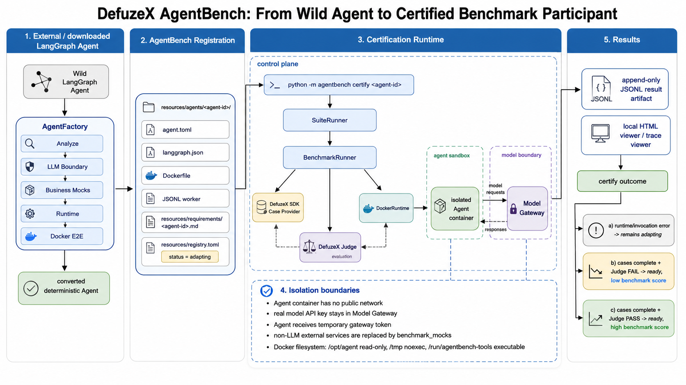

# AgentBehaviorBench (ABB)

<p align="center">
  
</p>

<p align="center">
  <a href="../README.md">English</a> |
  <a href="README.fr.md">Français</a> |
  日本語 |
  <a href="README.zh-CN.md">中文简体</a> |
  <a href="README.zh-TW.md">中文繁體</a> |
  <a href="README.ko.md">한국어</a>
</p>

<p align="center">
  
  
  
</p>

## ニュース

- AgentBehaviorBench (ABB) は、DefuzeX SDK の `get_input()` / `submit()` ハンドシェイクを通じて、登録済みの LangGraph Agent を実行するようになりました。

## 概要

AgentBehaviorBench (ABB) は、対象 Agent を呼び出し、その出力と実行トレースを収集し、要求されたワークフローを正しく完了したかを判定する必要があるエンドツーエンドのタスクで AI Agent を評価するためのベンチマークです。

登録済みの Agent と benchmark Case が与えられると、AgentBehaviorBench (ABB) は信頼されたホスト harness を通じてその Agent を実行します。この harness は、framework 固有またはコンテナ化された Agent を起動し、credential-safe な Model Interceptor を通じてモデル通信をルーティングし、各 SDK input と Agent response を append-only の JSONL events として記録し、完了した run を DefuzeX Judge に送信できます。

AgentBehaviorBench (ABB) は Agent 評価を再現可能にするために設計されています。Agent は registry で宣言され、LangGraph などの framework adapter を通じて適応され、`adapting` から `ready` へ認証されます。認証に成功した Agent だけがデフォルトの benchmark run に含まれます。

現在の実行フローは次のとおりです：

```text
registry.toml
-> SuiteRunner
-> BenchmarkRunner
-> DefuzeX SDK Run
-> Agent Adapter / Runtime
-> Judge Report
```

このリポジトリには以下が含まれます：

- `agentbench/cli`：ターミナル entry point と進捗出力。
- `agentbench/harness`：SDK handshake、suite execution、results、registry。
- `agentbench/adapter`：framework-neutral な adapter contract と LangGraph support。
- `agentbench/runtime`：local runtime と Docker runtime の integration。
- `resources/agents`：再現可能な benchmark agent fixtures。
- `services/model-interceptor`：Docker runs で model provider access を扱う透明な interceptor。



## セットアップ

AgentBehaviorBench (ABB) には Python 3.10 以降と DefuzeX Python SDK が必要です。SDK は AgentBehaviorBench (ABB) が使用する benchmark protocol を提供します。これにより、benchmark requirements の解析、DefuzeX Cases の作成、各 SDK input の駆動、evidence の記録、完了した runs の judging への送信が行われます。

このリポジトリを含む親 workspace から仮想環境を作成して有効化します：

```powershell
cd <workspace-root>
python -m venv .venv
.\.venv\Scripts\Activate.ps1
python -m pip install --upgrade pip
```

AgentBehaviorBench (ABB) を editable mode でインストールします：

```powershell
python -m pip install -e .\defuzeX_AgentBench
```

### 内部 SDK ビルド

このリポジトリは現在、内部 DefuzeX SDK の `dev` branch に依存しています。SDK が通常の package installation 用に公開されるまでは、`Defuze-SDK` をまだローカルに clone していない場合、SDK の `dev` branch（`https://github.com/DefuzeX-AI/Defuze-SDK/tree/dev`）から `defuzeX_AgentBench` の隣に clone し、同じ `.venv` にインストールしてください：

```powershell
cd <workspace-root>
git clone --branch dev --single-branch https://github.com/DefuzeX-AI/Defuze-SDK
python -m pip install -e .\Defuze-SDK
python -m pip install -e .\defuzeX_AgentBench
```

典型的な source checkout では、`Defuze-SDK` と `defuzeX_AgentBench` は同じ親 workspace の下にある sibling directories であり、どちらも editable mode でインストールされます。

> [!NOTE]
> PAT は Personal Access Token を意味します。内部 DefuzeX SDK リポジトリが private の場合、GitHub は HTTPS で clone するときに PAT を要求することがあります。PAT はパスワードとして扱ってください。source files、README examples、notebooks、commit された `.env` files には入れないでください。

## 使い方

AgentBehaviorBench (ABB) をインストールしたら、benchmark workspace から launcher script で起動します：

```powershell
cd <workspace-root>
.\.venv\Scripts\Activate.ps1
python .\run_agentbench.py
```

AgentBehaviorBench (ABB) リポジトリから package を直接実行することもできます：

```powershell
cd <workspace-root>\defuzeX_AgentBench
python -m agentbench
```

run を保存し、local result viewer で live benchmark events を確認するには、output path を渡します：

```powershell
python -m agentbench --output results\result.json
```

`--output` を指定しない場合、AgentBehaviorBench (ABB) はターミナルで実行され、JSONL result artifact は作成されません。`--output` を指定すると、AgentBehaviorBench (ABB) は append-only の JSONL result file を書き込み、local viewer を起動します。これにより、benchmark の実行中に events を更新して確認できます。

official Case または Judge providers を使う場合は、DefuzeX API key を設定します：

```powershell
$env:DEFUZEX_API_KEY = "dfx_<public-id>.<secret>"
```

テストスイートを実行します：

```powershell
python -m pytest
```

Agent 向けの詳細な手順は [AGENTS.md](../AGENTS.md) から始めてください。より長いドキュメントガイドは [docs/AGENTS.md](../docs/AGENTS.md) にあります。

## テスト対象 Agent の追加方法

自分の Agent を benchmark に追加したい場合は、agent に [docs/How To Add Agent.md](../docs/How%20To%20Add%20Agent.md) を読ませ、そこに記載された onboarding flow に従わせてください。

AgentBehaviorBench (ABB) は、外部 Agent project を repeatable benchmark target に変換するために必要な要素を提供します。registry-based discovery、framework adapters、Docker runtime support、Model Interceptor 経由の model credential routing、append-only result artifacts、local result viewing、そして `adapting` から `ready` への certification です。これにより、同じ DefuzeX Cases に対して一貫した方法で Agent を比較しながら、runtime behavior、outputs、judgment evidence を検査可能に保てます。

## 引用とライセンス

MIT License。詳しくは [LICENSE](../LICENSE) を参照してください。

私たちの成果が役に立つ場合は、次の形式で引用してください：
